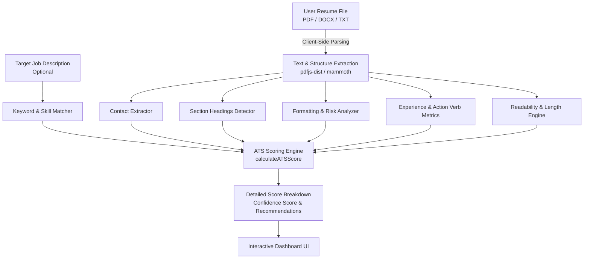

<p align="center">
  <a href="https://github.com/Sujoymoulick/ats-checker">
    
  </a>
</p>

<h1 align="center">Gigpilot AIScore — Privacy-First ATS Resume Checker & LaTeX Builder</h1>

<p align="center">
  <b>A 100% Client-Side, Privacy-Preserving ATS Resume Analyzer, Scoring Engine, and Live LaTeX Resume Compiler.</b>
</p>

<p align="center">
  <a href="https://github.com/Sujoymoulick/ats-checker/releases"></a>
  <a href="https://astro.build"></a>
  <a href="https://www.typescriptlang.org/"></a>
  <a href="https://pages.cloudflare.com/"></a>
  <a href="./LICENSE"></a>
  
</p>

---

## 🌟 Overview

**Gigpilot AIScore** is an advanced, privacy-first Applicant Tracking System (ATS) resume checker, scorer, and interactive LaTeX resume builder. Built with modern web technologies, it allows job seekers to evaluate their resumes against actual ATS parsing standards, optimize keyword alignment for specific job descriptions, identify formatting risks, and compile ATS-optimized LaTeX resumes in real-time.

Unlike traditional ATS checkers that upload user resumes to third-party servers, **Gigpilot AIScore executes 100% in the browser**. Your personal data, contact information, and employment history never leave your device.

---

## ✨ Key Features

- 🔒 **100% Client-Side Privacy**: Parses PDF, DOCX, and TXT files entirely inside the browser using client-side WebAssembly and JS parsers (`pdfjs-dist` and `mammoth`). Zero server file uploads.
- 🎯 **Multi-Dimensional ATS Scoring Engine**: Evaluates resumes across 6 key axes:
  - **Contact Information Extraction**: Checks for complete contact details (email, phone, LinkedIn, location, portfolio).
  - **Section Structure Verification**: Detects standard headers (Summary, Experience, Education, Skills, Projects, Certifications).
  - **Keyword & Skill Matching**: Compares resume text against target job descriptions to extract matching and missing hard/soft skills.
  - **Formatting & Scannability Risk**: Detects unparseable image-based PDFs, multi-column layouts, tables, and typography issues.
  - **Action Verb & Experience Impact**: Measures quantified metrics (`%`, `$`, numbers) and active leadership verbs.
  - **Readability & Length Metrics**: Analyzes word count, sentence complexity, and section balance.
- 📊 **Target ATS Benchmark Calibration**: Calibrates scores against 10 synthetic benchmark job profiles including Software Engineer, Data Scientist, Product Manager, Engineering Manager, UX Designer, Financial Analyst, Marketing Manager, and more.
- 📄 **Interactive LaTeX Resume Builder & PDF Compiler**: Live in-browser LaTeX resume editor equipped with clean, ATS-compliant resume templates (such as Jake's Resume) and instant PDF generation.
- ⚠️ **Instant Formatting Risk Warnings**: Highlights parsing risks like scanned image PDFs, non-standard section headers, and unreadable characters before you submit to real job portals.

---

## 🏗️ Architecture & Parsing Pipeline



---

## 🛠️ Technology Stack

- **Framework**: [Astro 5](https://astro.build) (Hybrid / Static Site Generation)
- **Language**: [TypeScript](https://www.typescriptlang.org/)
- **Document Parsing**:
  - `pdfjs-dist` — Client-side PDF text and metadata extraction
  - `mammoth` — Client-side DOCX document parsing
- **LaTeX Engine**: Built-in client-side PDF Generator & LaTeX Compiler
- **Styling**: Modern CSS3 (CSS Variables, Flexbox/Grid, Glassmorphism design)
- **Deployment**: [Cloudflare Pages](https://pages.cloudflare.com/) via `@astrojs/cloudflare` and `wrangler`

---

## 📁 Repository Structure

```text
ats-checker/
├── public/
│   ├── logoblack.png           # Gigpilot AIScore Site Logo
│   ├── favicon.svg             # Application Favicon
│   └── site.webmanifest        # PWA & Web Manifest
├── src/
│   ├── components/             # UI Components
│   │   ├── ATSCheckerApp.astro # Main ATS Scanner & Analyzer Interface
│   │   ├── ATSScore.astro      # Overall Score Display & Visual Gauge
│   │   ├── FormattingIssues.astro # Scannability & Formatting Warning List
│   │   ├── KeywordAnalysis.astro  # Matching vs Missing Skills Breakdown
│   │   ├── ScoreBreakdown.astro   # Detailed 6-Axis Category Breakdown
│   │   └── latex/              # LaTeX Builder & Compiler Components
│   ├── data/                   # Scoring Rules & Benchmark Profiles
│   │   ├── actionVerbs.ts      # Comprehensive Action Verb Dictionary
│   │   ├── ats-benchmarks/    # Benchmark JSON Profiles (10 Job Titles)
│   │   └── ats-scoring-rules.ts# Weighted Scoring Weights & Rules
│   ├── lib/
│   │   ├── ats/                # Core ATS Analysis Logic
│   │   │   ├── analyzer.ts     # Main Resume Analyzer Entrypoint
│   │   │   ├── contactExtractor.ts # Regex & Rule Contact Extractor
│   │   │   ├── keywords.ts     # Skill & Keyword Matching Engine
│   │   │   ├── pdfParser.ts    # Client-side PDF Text Reader
│   │   │   └── scoring.ts      # Multi-dimensional Scoring Math
│   │   └── latex/              # In-Browser LaTeX Compiler Engine
│   └── pages/                  # Astro Page Routes
│       ├── index.astro         # Homepage
│       ├── ats-resume-checker.astro # Main ATS Scanner Page
│       └── free-ats-checker.astro # Dedicated Scanner Entrypoint
├── astro.config.mjs            # Astro Configuration
├── package.json                # Project Dependencies & Scripts
└── README.md                   # Project Documentation
```

---

## 🚀 Getting Started

### Prerequisites

- **Node.js**: `^22.12.0` or higher
- **npm**: `v10+`

### Installation

1. **Clone the repository**:
   ```bash
   git clone https://github.com/Sujoymoulick/ats-checker.git
   cd ats-checker
   ```

2. **Install dependencies**:
   ```bash
   npm install
   ```

### Development

Start the local development server:

```bash
npm run dev
```

Open your browser and navigate to `http://localhost:4321`.

> **Note for AI Agents & Background Execution**: You can start the dev server in background mode:
> ```bash
> astro dev --background
> ```

---

## 🧪 Testing Suite

Gigpilot AIScore comes with a built-in automated test suite covering section detection, contact extraction, LaTeX compilation, and ATS benchmark calibration.

To run the test suite:

```bash
npm test
```

**Test Coverage Includes**:
- ✅ Synthetic resume benchmark scoring against perfect & flawed resumes
- ✅ Keyword stuffing & formatting penalty verification
- ✅ Image-only PDF detection and risk scoring
- ✅ Contact info parser accuracy (preventing false positives)
- ✅ LaTeX resume template output & syntax escaping

---

## 📦 Building & Deployment

### Build for Production

To create an optimized production build:

```bash
npm run build
```

### Preview Local Build

```bash
npm run preview
```

### Deploy to Cloudflare Pages

This project is pre-configured for Cloudflare Pages adapter (`@astrojs/cloudflare`). To deploy directly:

```bash
npm run deploy
```

---

## 📄 License

This project is licensed under the [MIT License](./LICENSE).

---

<p align="center">
  Crafted with ❤️ by <a href="https://github.com/Sujoymoulick">Sujoy Moulick</a>
</p>
